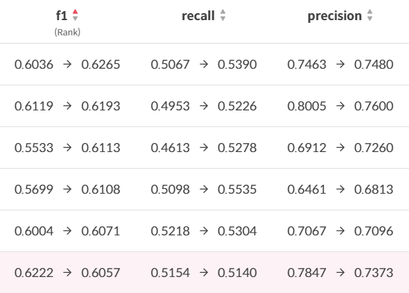

<!-- ## Data Annotation -->

## Member🔥
| [김범준](https://github.com/quasar529) | [백우열](https://github.com/wooyeolBaek) | [조용재](https://github.com/yyongjae) | [조윤재](https://github.com/KidsareBornStars) | [최명헌](https://github.com/MyeongheonChoi) |
| :-: | :-: | :-: | :-: | :-: |
|  |  |  |  |  |
***
## Index
- [Member🔥](#member)
- [Index](#index)
- [Project Summary](#project-summary)
  - [대회 주제 및 개요](#대회-주제-및-개요)
  - [데이터셋의 구조](#데이터셋의-구조)
- [Procedures](#procedures)
- [Result](#result)
- [How to Run](#how-to-run)
  - [train](#train)
  - [inference](#inference)
  - [evaluation](#evaluation)
- [Folder Directory](#folder-directory)
***

## Project Summary

### 대회 주제 및 개요

OCR (Optimal Character Recognition) 기술은 사람이 직접 쓰거나 이미지 속에 있는 문자를 얻은 다음 이를 컴퓨터가 인식할 수 있도록 하는 기술로, 
컴퓨터 비전 분야에서 현재 널리 쓰이는 대표적인 기술 중 하나이다.

OCR task는 글자 검출 (text detection), 글자 인식 (text recognition), 정렬기 (Serializer) 등의 모듈로 이루어져 있고 본 대회에선 **'글자 검출'** task 만을 해결한다.

단, 평가 방식이 예측 CSV 파일 제출 (Evaluation) 방식이 아닌 
**Model Checkpoint 와 inference.py 를 제출하여 채점**하는 방식이다.

### 데이터셋의 구조
**학습 데이터**는 기본적으로 536개의 샘플로 이루어진 "**ICDAR17_Korean**"이라는 이름의 데이터셋이 제공됐다. 

이는 ICDAR17-MLT 데이터셋에서 언어가 한글인 샘플들만 모아서 재구성한 것으로 
원본 MLT 데이터셋의 부분집합이다.

본 대회는 데이터를 수집하고 활용하는 방법이 주요 내용이기 때문에, 성능 향상을 위해 
공공 데이터셋 혹은 직접 수집한 데이터셋을 추가적으로 이용하는 것을 제한하지 않았다.

**평가 데이터**는 크롤링된 다양한 이미지 (손글씨, 간판, 책표지 등) 총 300장으로 구성되어 있고 언어는 주로 한국어이고, 영어, 그 외 다른 언어도 있지만
한국어, 영어가 아닌 다른 언어는 don't care 처리하므로 검출하지 않아도 됐다.

Public 테스트셋으로는 50%인 150장이 공개되고, 나머지 데이터 150장은 Private 테스트셋으로 활용됐다.

***
## Procedures
Test 데이터에 대한 정보를 알 수 없기 때문에,  Test set과 유사할 것이라 생각되는, 최대한 많은 데이터를 모아 Public Leaderboard점수를 향상시키는 것을 목표로 했다. 

주어진 데이터셋 외에 **ICDAR15**(약 1000장)(https://rrc.cvc.uab.es/?ch=4&com=downloads), **ICDAR17**(약 9000장)(https://rrc.cvc.uab.es/?ch=8&com=downloads), **ICDAR19**(약 10000장)(https://rrc.cvc.uab.es/?ch=15&com=downloads) 데이터셋을 사용했는데, 처음엔 각각의 데이터셋을 사용 시 점수가 어느 수준인지 파악해 더 좋은 데이터셋을 선택해 사용하려 했지만, 해당 데이터셋의 품질이 보증되어 있고 또 그러한 데이터의 수가 많으면 많을수록 좋다고 생각해 두 데이터셋을 합쳐서 사용했다.

이 때, 한국어, 영어 외의 다른 언어는 모두 **Don’t Care** 처리를 하지만, 여러 나라의 
다양한 언어를 학습시킨다면 모델이 글자를 검출하는 데에 더욱 도움이 될 것이라는 가정으로 출발하여 Hindi, Bangla, Arabic 등 다양한 언어 데이터를 학습시키는데 사용했다. 

추후에 주최 측에서 추가적으로 **Upstage 데이터셋**(교육생들이 직접 Annotation을 수행한 약 900개의 데이터)을 제공해 줬는데 이 데이터셋은 다른 데이터셋의 Annotation 양식과 달리 bounding box가 Rectangle이 아닌 Polygon 형태로 작성된 것이 있었다. 
이를 다루기 위한 방법으로 첫 번째는 Polygon에 외접하는 사각형을 bounding box로 사용하는 것이었고, 두 번째는 polygon을 쪼개어 여러 개의 rectangle 모양의 bounding box로 만드는 것이다. 
두 방법 모두 사용해보며 실험을 진행했고 점수엔 큰 차이가 없었다.

우리는 데이터의 수가 충분하지 않다고 생각해서 실제 데이터 외에 Synthetic Dataset을 이용해 학습에 사용되는 데이터셋의 크기를 키웠다.
Synthetic Dataset으로 Pretrain 후 Target Dataset으로 ICDAR 혹은 
Upstage 데이터셋을 사용해 Finetuning을 진행했고, 
이 때 Synthetic Dataset으론 **ICDAR19에 Synthetic Text를 합성한 데이터셋**과 Carnegie Mellon University의 **UnrealText**(https://github.com/Jyouhou/UnrealText)를 사용하여 Pretrain한 모델을 사용했다.
Public 점수는 큰 변화가 없었지만, Private 점수가 유의미하게 상승한 것으로 보아 Generalization 성능이 좋았다고 추측할 수 있다.

***
## Result



Public과 Private 점수 차이가 상당했다.
Generalization 성능을 향상시키는 것이 private 점수에 큰 영향을 줬을 것이라 추측할 수 있다.

또한 데이터셋의 규모가 커질수록 학습시간도 비례해서 길어져야 하는데 다양한 조건으로 많은 실험을 진행하느라 일정 시간 이상으로 학습을 시키지 못해 높은 점수를 받지 못한 것 같다.
***
## How to Run
### train
```
python train.py --max_epoch 200 --image_size 1024 --input_size 512 --train_batch_size 32
```

### inference
```
python inference.py 
```

### evaluation
```
python evaluation.py
```
***
## Folder Directory  
```
📂 level2_dataannotation_cv-level2-cv-01  
│      
├── 📂 utils  
│      │  
│      ├── 📂 CV_strategy
│      │        │
│      │        └── 📑 word_box.ipynb    
│      │        
│      ├── 📑 rare.ipynb  
│      └── 📑 txt2json.ipynb  
│
├── 📑 convert_mlt.py
│
├── 📑 dataset.py
│  
├── 📑 detect.py  
│
├── 📑 deteval.py  
│
├── 📑 east_dataset.py
│
├── 📑 evaluation.py
│
├── 📑 inference.py
│
├── 📑 loss.py
│
├── 📑 model.py
│
├── 📑 OCR_EDA.ipynb
│
└── 📑 train.py  
```

***
